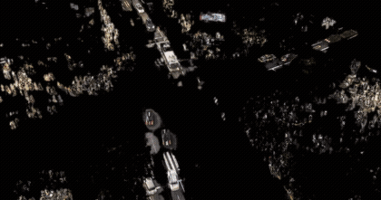
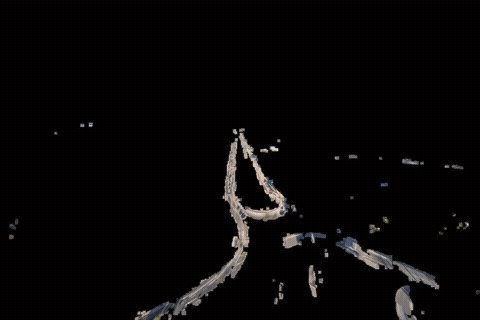
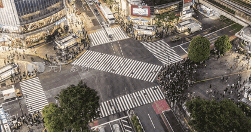
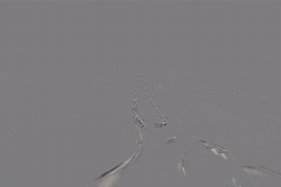
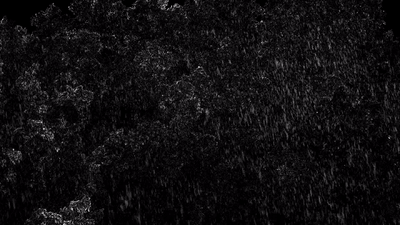

<div align="center">

# Motiff

**Make motion visible.**

Highlight moving objects, turn them into glowing silhouettes,
trace their trails — or make them disappear from the frame entirely.

Pure `ffmpeg` + `Bash`. No Python. No OpenCV. No GPU. No deep learning.

[](#)
[](#)
[](LICENSE)

[English](#english) · [中文](#中文)

</div>

---

## English

### What is Motiff?

Motiff is a tiny toolkit of `ffmpeg` filter graphs that expose **motion** in a
video. It works on any file `ffmpeg` can read, runs in seconds, and needs
nothing but a shell.

| Mode | Command | Result |
|---|---|---|
| 🟠 **Highlight** | `motion_highlight.sh -i in.mp4` | Static areas stay untouched, moving pixels glow in the color you choose |
| 👻 **Silhouette** | `motion_highlight.sh -i in.mp4 -s` | Only moving parts are shown, everything static goes black |
| 🫥 **Erase** | `motion_highlight.sh -i in.mp4 -x` | Moving people/cars are replaced by a background estimate — they vanish |
| 🌊 **Trail** | `motion_diff.sh -i in.mp4 -n 5` | Time-shifted, inverted ghost of past/future frames for motion trails |

### Demos

**Highlight** — moving objects light up, the scene stays intact



**Silhouette** — only motion survives



**Erase** — moving objects are replaced by the background



**Trail** — temporal difference / motion echo



**Rain & foliage** — high-frequency motion (rain, leaves, water) also lights up



### Install

Requirements: [`ffmpeg`](https://ffmpeg.org/download.html) on your `PATH`.

```bash
git clone git@github.com:sixiaozhe/Motiff.git
cd Motiff
chmod +x motion_highlight.sh motion_diff.sh
```

### Quick start

```bash
# Orange motion highlight over the original scene
./motion_highlight.sh -i input.mp4

# Black background, orange motion lines only
./motion_highlight.sh -i input.mp4 -b -c ff7319

# Silhouette: reveal only what moves
./motion_highlight.sh -i input.mp4 -s

# Make moving objects disappear
./motion_highlight.sh -i input.mp4 -x -n 31

# Motion trails (5-frame trail)
./motion_diff.sh -i input.mp4 -n 5

# Leading ghost (future frames)
./motion_diff.sh -i input.mp4 -n -5
```

### Why Motiff?

- **Zero dependencies** — if `ffmpeg` runs, Motiff runs. Servers, CI, Raspberry Pi.
- **No training, no model weights** — it's pure filter math, deterministic and instant.
- **Actually tunable** — threshold, gain, color, edge feathering, temporal denoise,
  reference frame gap and background window are all exposed as flags.
- **Hackable** — each script is ~100 lines of readable Bash; extend the filter chain yourself.

### How it works

- `motion_highlight.sh` computes `|current − reference|`, thresholds out sensor
  noise, then blends the result back as a highlight mask (or as a matte for
  silhouette/erase modes). Erase mode estimates the background with a temporal
  median over a sliding window.
- `motion_diff.sh` negates a time-shifted copy of the frame and blends it back
  semi-transparently, so past/future motion shows up as a colored ghost.

Full option list: [docs/cheatsheet.md](docs/cheatsheet.md) · run any script with `-h`.

### Tests

```bash
bash tests/run_tests.sh
bash tests/test_highlight.sh
```

### License

[MIT](LICENSE) © sixiaozhe

---

## 中文

### Motiff 是什么？

Motiff 是一组基于 `ffmpeg` 滤镜链的极简脚本，用来把视频里的**运动**可视出来。
任何 `ffmpeg` 能读的视频都能处理，秒级出片，除了 shell 什么都不需要。

| 模式 | 命令 | 效果 |
|---|---|---|
| 🟠 **运动高亮** | `motion_highlight.sh -i in.mp4` | 静态画面不变，运动像素按指定颜色发光 |
| 👻 **剪影透层** | `motion_highlight.sh -i in.mp4 -s` | 只显示运动部分，静止区域黑屏 |
| 🫥 **物体隐形** | `motion_highlight.sh -i in.mp4 -x` | 运动的人/车被背景估计替换，凭空消失 |
| 🌊 **残影拖尾** | `motion_diff.sh -i in.mp4 -n 5` | 时间差分，把过去/未来的运动叠成残影 |

### 安装

依赖：`PATH` 中有 [`ffmpeg`](https://ffmpeg.org/download.html)。

```bash
git clone git@github.com:sixiaozhe/Motiff.git
cd Motiff
chmod +x motion_highlight.sh motion_diff.sh
```

### 快速开始

```bash
./motion_highlight.sh -i input.mp4            # 橙色运动高亮
./motion_highlight.sh -i input.mp4 -b         # 黑底白线
./motion_highlight.sh -i input.mp4 -s         # 剪影: 只留下动的东西
./motion_highlight.sh -i input.mp4 -x         # 让运动物体消失
./motion_diff.sh      -i input.mp4 -n 5       # 5 帧拖尾
./motion_diff.sh      -i input.mp4 -n -5      # 前导残影
```

### 为什么用 Motiff？

- **零依赖**：能跑 `ffmpeg` 就能跑，服务器 / CI / 树莓派都行。
- **无需训练**：不是深度学习，纯滤镜数学，确定、即时。
- **可调**：阈值、增益、颜色、边缘羽化、时域降噪、参考帧距、背景窗口全部开放为参数。
- **易改**：每个脚本约 100 行可读 Bash，想加效果直接改滤镜链。

### 完整参数

见 [docs/cheatsheet.md](docs/cheatsheet.md)，或对任意脚本运行 `-h`。

### 许可证

[MIT](LICENSE) © sixiaozhe
